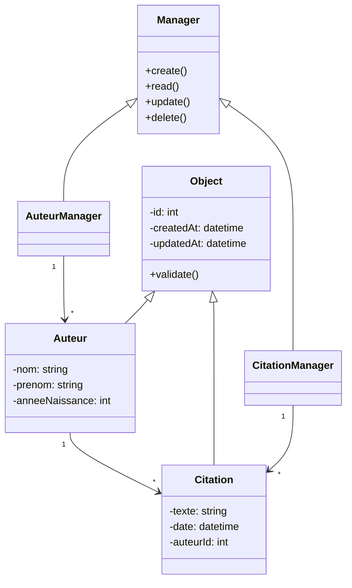

# Système de Gestion des Auteurs et des Citations

## Vue d'ensemble

Ce système permet la création et la gestion des auteurs et de leurs citations. Un auteur peut avoir plusieurs citations, mais une citation appartient uniquement à un auteur.

## Classes

### UML

### Auteur

Représente un auteur avec les propriétés suivantes :
- Nom
- Prénom
- Année de Naissance

Les méthodes incluent obtenir le nom complet de l'auteur et récupérer toutes les citations associées.

### Citation

Représente une citation, contenant :
- Le texte de la citation
- La date
- L'auteur

Les méthodes incluent obtenir le texte, la date de la citation, et l'auteur associé.

### Système

Fonctionne comme un gestionnaire pour :
- Ajouter et récupérer des auteurs
- Ajouter et récupérer des citations
- Obtenir toutes les citations d'un auteur spécifique

## Utilisation

Le système offre une interface pour ajouter des auteurs et des citations au système, ainsi que pour permettre la consultation des citations par auteur.

## Licence

Ce projet est sous licence MIT.
