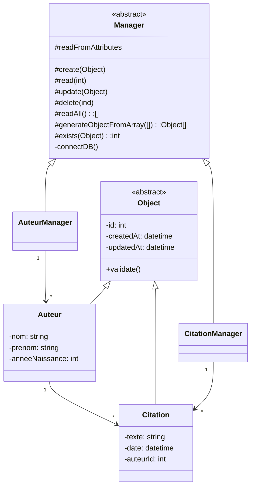

# Système de Gestion des Auteurs et des Citations

## Vue d'ensemble

Projet développé pour étudier la PHP brute.

### Pour installer la base de données :

Changez la variable `$new_database` par le nom que vous voulez donner à votre nouvelle base de données.

Après avoir accédé à l'adresse, le script générera une nouvelle base de données sans données.

Accéder au fichier `config/init.php` à l'adresse http://localhost:8888/citationSysteme/config/init.php.

### UML

## Licence

Ce projet est sous licence MIT.
